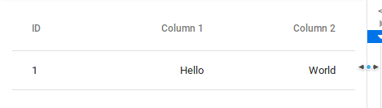

# React Scaled Component (`react-scaled-component`)



Most time, you want to create a custom component for when responsive website is needed. However, other times you simply need it to **scale down when the "breaking point" is reached horizontally**. This library does just that.

## Prerequisites
React: `^16.7.0-alpha.0`
> This is due to us using the [Hooks API](https://reactjs.org/docs/hooks-intro.html)

## Install
```
yarn add react-scaled-component
```

## Usage
```js
import ScaledComponent from 'react-scaled-component'

function MyComponent() {
  return (
    <ScaledComponent>
      ...
    </ScaledComponent>
  )
}
```

## Scaling react component instead of DOM elements

If you're passing through a react component instead of DOM element into ScaledComponent, it might not work. Be sure to pass the ref of the container up the tree so we can get it.

Otherwise, you can also pass the attribute `renderChild` which should be a *function* that renders the child with appropriate refs.

Example with [material-ui](https://material-ui.com/api/root-ref/#__next):
```js
import ScaledComponent from 'react-scaled-component'
import { RootRef, Table } from '@material-ui/core'

function MyComponent() {
  return (
    <ScaledComponent renderChild={(ref, child) => (
      <RootRef rootRef={ref} children={child} />
    )}>
      <Table>
        ...
      </Table>
    </ScaledComponent>
  )
}
```

## How it works

There aren't really a good way to get the size of a container the moment it stops scaling horizontally. We need to know this to calculate how much to scale.

To achieve this, this library simply render the children *twice* in order to calculate it.

If there's a better way to approach this, please create a PR or open an issue, thanks!

## Possible improvements

This is a really fast and simple component so there are plenty of things to improve. Some of them: 
1. Guard against multiple children (not sure if this is even an issue)
2. Tests
3. We use `@rehooks/component-size` which might require a polyfill
4. Vertical scale?